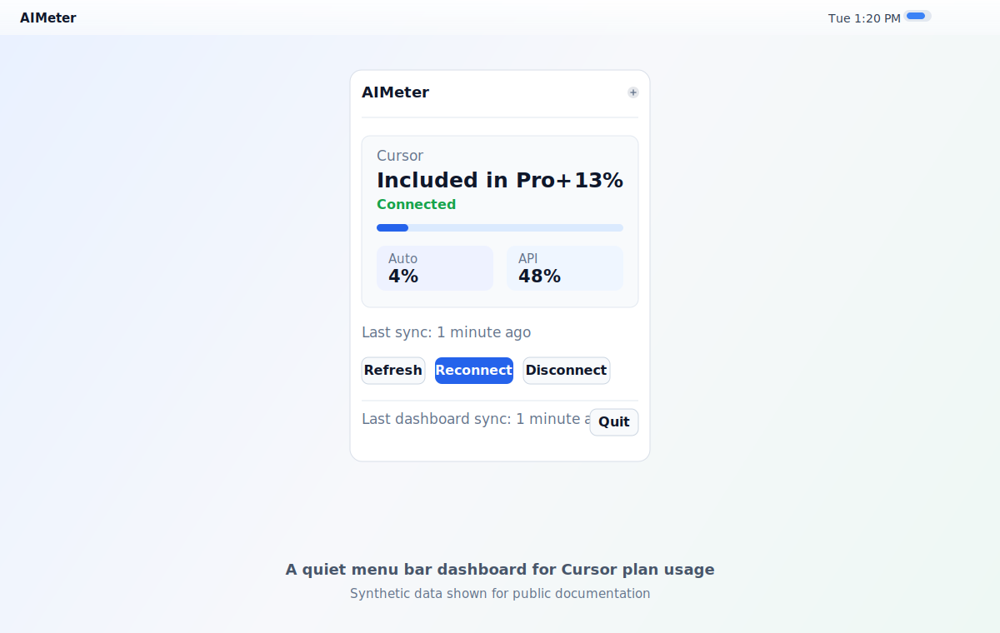
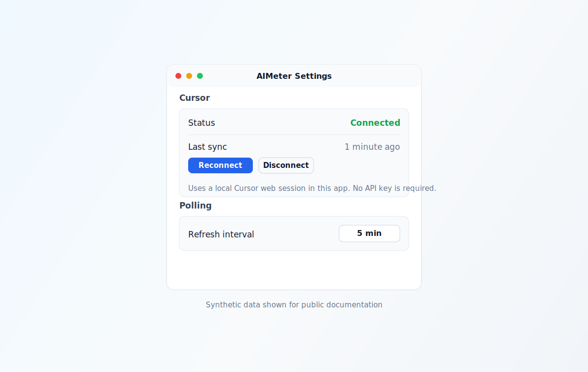

# AIMeter


AIMeter is a minimal macOS menu bar app for tracking personal Cursor plan usage from an authenticated local web session. It gives you a quiet, glanceable dashboard for the usage numbers that usually live several clicks deep in Cursor settings.

> AIMeter is an experimental, unofficial Cursor integration. It does not use Cursor APIs, and it may need updates when Cursor changes its account pages.



## Highlights

- Native macOS menu bar utility with no Dock icon.
- Tracks Cursor total, Auto, and API usage.
- Uses a local `WKWebView` session, so no provider API keys are required.
- Keeps the latest successful usage snapshot visible if a background refresh fails.
- Includes parser and coordinator tests for Cursor page changes.
- Ships with a DMG build script and optional Apple notarization flow.

## Screenshots

| Dashboard | Settings |
| --- | --- |
|  |  |

The screenshots use synthetic data so public documentation never exposes personal usage details.

## What AIMeter Tracks

| Provider | Metrics |
| --- | --- |
| Cursor | Plan label, total usage percentage, Auto usage percentage, API usage percentage |

## Privacy Model

AIMeter stores Cursor login state inside the app's local WebKit website data store. It does not ask for API keys and does not send usage data to an AIMeter server.

Important notes:

- AIMeter only loads HTTPS Cursor pages from `cursor.com` or `www.cursor.com`.
- Network response parsing is host-filtered to Cursor pages and caps captured response bodies at 50 KB.
- Cursor sessions can expire and require reconnecting.
- Disconnecting Cursor clears its local WebKit website data for AIMeter.
- Do not include personal account data, cookies, or unredacted screenshots in issues or pull requests.

## Requirements

- macOS 14 or newer
- Xcode 26.2 or newer
- Xcode command line tools
- [XcodeGen](https://github.com/yonaskolb/XcodeGen)

Install XcodeGen:

```bash
brew install xcodegen
```

## Build From Source

From the repository root:

```bash
xcodegen generate
xcodebuild -project AIMeter.xcodeproj -scheme AIMeter -destination "platform=macOS" -derivedDataPath ./.derived build
```

Run the app:

```bash
open ./.derived/Build/Products/Debug/AIMeter.app
```

The app runs as an `LSUIElement` menu bar utility, so it appears in the menu bar instead of the Dock.

## Connect Accounts

1. Launch AIMeter.
2. Open the menu bar popover.
3. Click `Connect Cursor` and sign in inside the Cursor connection window.
4. AIMeter closes the connection window once it detects usage data and then refreshes in the background.

## Test

```bash
xcodebuild -project AIMeter.xcodeproj -scheme AIMeter -destination "platform=macOS" -derivedDataPath ./.derived test
```

## Package A Release

Build a local unsigned DMG for testing:

```bash
./scripts/build_dmg.sh
```

The output is written to:

```text
dist/AIMeter.dmg
```

Unsigned local DMGs are convenient for development, but macOS Gatekeeper will warn users that Apple cannot verify the app. Public releases should be signed, notarized, and stapled.

Build a signed and notarized DMG with a saved notary profile:

```bash
DEVELOPMENT_TEAM=TEAMID1234 \
NOTARYTOOL_PROFILE=your-profile \
./scripts/build_dmg.sh --notarize
```

Or with direct Apple credentials:

```bash
APPLE_ID=me@example.com \
APPLE_TEAM_ID=TEAMID1234 \
APPLE_APP_SPECIFIC_PASSWORD=app-specific-password \
./scripts/build_dmg.sh --notarize
```

Notarized releases also require a `Developer ID Application` certificate in your login keychain. The script verifies the app signature, signs the final DMG, uploads it to Apple, staples the ticket, and validates the result.

Verify the final public DMG:

```bash
xcrun stapler validate dist/AIMeter.dmg
spctl -a -vv --type open --context context:primary-signature dist/AIMeter.dmg
```

See [docs/release-checklist.md](docs/release-checklist.md) before publishing a GitHub release.

## Project Structure

```text
Sources/AIMeter/App       App lifecycle and dependency wiring
Sources/AIMeter/Core      Shared models, formatting, stores, and parser helpers
Sources/AIMeter/Cursor    Cursor web-session client, scraper, and parser
Sources/AIMeter/Storage   UserDefaults-backed settings persistence
Sources/AIMeter/UI        Menu bar, popover, settings, and connection windows
Tests/AIMeterTests        Parser, coordinator, settings, and dashboard tests
scripts                   Release packaging helpers
docs                      Screenshots and release notes
```

## Limitations

- AIMeter relies on authenticated local web sessions.
- Cursor can change routes, DOM structure, response shapes, or copy at any time.
- Background refresh may fail until you reconnect after session expiry.
- Usage values are only as accurate as the Cursor pages AIMeter can read.

## Contributing

Contributions are welcome. Start with [CONTRIBUTING.md](CONTRIBUTING.md), keep parser changes covered by tests, and avoid committing generated build products from `.derived/`, `.derived-release/`, or `dist/`.

Security-sensitive issues should be reported privately. See [SECURITY.md](SECURITY.md).

## License

MIT. See [LICENSE](LICENSE).
