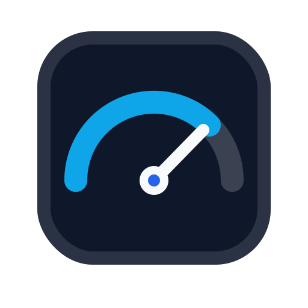
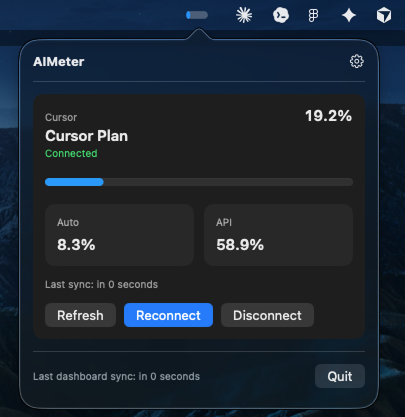
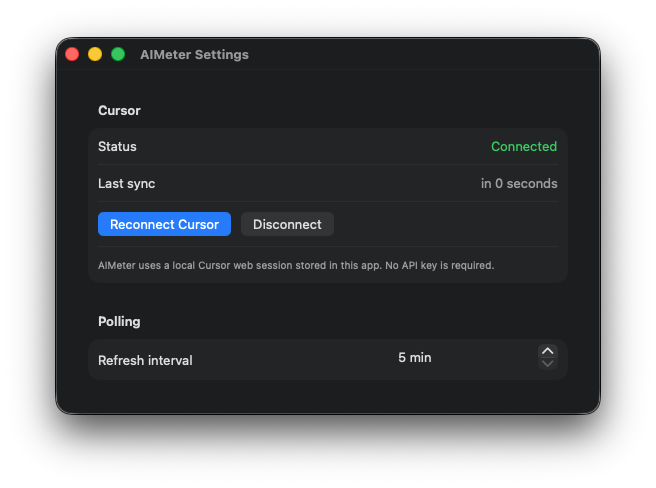

# AIMeter

AIMeter is a minimal macOS menu bar app for tracking personal Cursor plan usage from an authenticated local web session. It gives you a quiet, glanceable dashboard for the usage numbers that usually live several clicks deep in Cursor settings.

> AIMeter is an experimental, unofficial Cursor integration. It does not use Cursor APIs, and it may need updates when Cursor changes its account pages.

## Highlights

- Native macOS menu bar utility with no Dock icon.
- Tracks Cursor total, Auto, and API usage.
- Uses a local Cursor web session, so no API key is required.
- Keeps the latest successful usage snapshot visible if a background refresh fails.

## Screenshots

| Dashboard | Settings |
| --- | --- |
|  |  |

The screenshots show the current macOS menu bar dashboard and settings window.

## Install

### Download The App

1. Open the latest [GitHub Release](https://github.com/divyanshub024/aimeter/releases).
2. Download `AIMeter.dmg`.
3. Open the DMG.
4. Drag `AIMeter` into `Applications`.
5. Launch `AIMeter` from `Applications`.

AIMeter is a menu bar app, so it does not appear in the Dock. After launch, look for the small progress bar in the macOS menu bar.

### First Setup

1. Click the AIMeter menu bar item.
2. Click `Connect Cursor`.
3. Sign in to Cursor in the connection window.
4. AIMeter closes the connection window after it detects your usage data.

If the menu bar is crowded, macOS may hide some menu bar apps. AIMeter uses a compact progress-bar menu item, but you may still need to reduce other menu bar items or open Control Center/Menu Bar settings.

### Update

Download the newer `AIMeter.dmg` from GitHub Releases, drag the new `AIMeter` app into `Applications`, and replace the old copy.

## How It Works

AIMeter reads the same Cursor usage information you can see after signing in on Cursor's account/settings pages.

- It opens Cursor in a local browser view owned by AIMeter.
- Your Cursor sign-in stays local to AIMeter.
- AIMeter only loads Cursor pages from `cursor.com` and `www.cursor.com`.
- It reads the usage values shown by Cursor and displays them in the menu bar.
- It keeps the latest successful snapshot visible if a later refresh fails.
- It never sends your usage data to an AIMeter server.

Disconnecting Cursor from AIMeter clears the app's local Cursor sign-in data. Cursor sessions can still expire normally, in which case AIMeter will ask you to reconnect.

## What AIMeter Tracks

| Provider | Metrics |
| --- | --- |
| Cursor | Plan label, total usage percentage, Auto usage percentage, API usage percentage |

## Privacy

AIMeter stores Cursor login state locally on your Mac. It does not ask for API keys and does not send usage data to an AIMeter server.

Important notes:

- AIMeter only loads HTTPS Cursor pages from `cursor.com` or `www.cursor.com`.
- Cursor sessions can expire and require reconnecting.
- Disconnecting Cursor clears AIMeter's local Cursor sign-in data.
- Do not include personal account data, cookies, or unredacted screenshots in issues or pull requests.

## Requirements

- macOS 14 or newer

## Limitations

- AIMeter relies on authenticated local web sessions.
- Cursor can change routes, DOM structure, response shapes, or copy at any time.
- Background refresh may fail until you reconnect after session expiry.
- Usage values are only as accurate as the Cursor pages AIMeter can read.

## Support

Open a GitHub issue if AIMeter cannot connect, the usage values look wrong, or Cursor changes its settings pages.

Security-sensitive issues should be reported privately. See [SECURITY.md](SECURITY.md).

## License

MIT. See [LICENSE](LICENSE).
